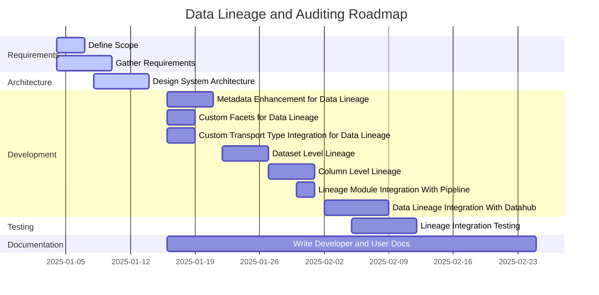
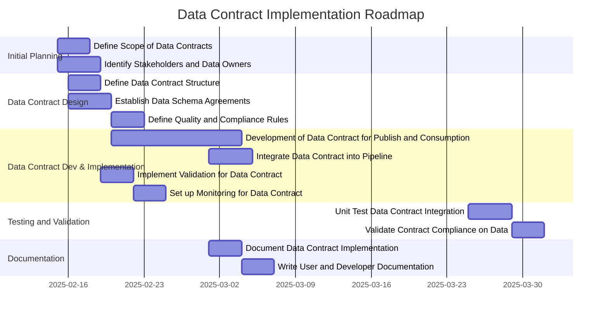
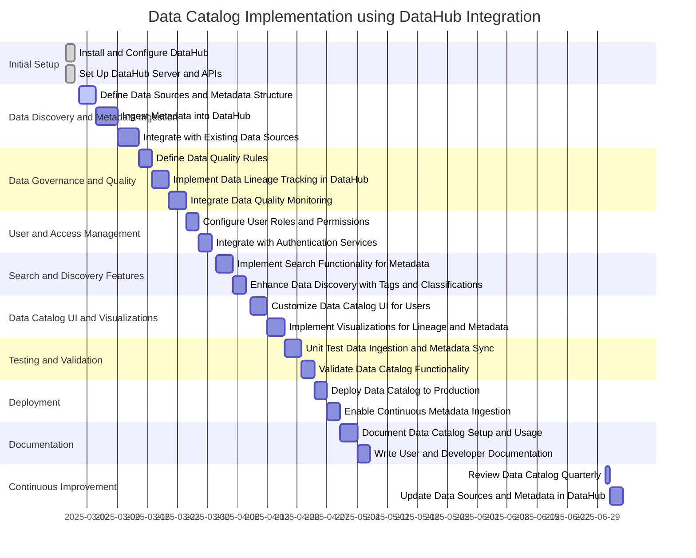
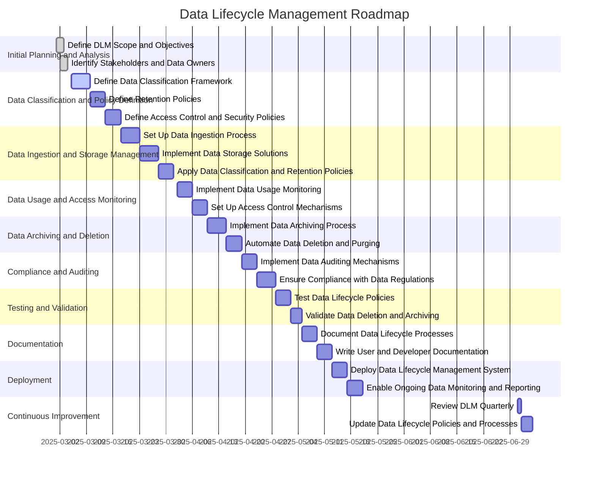

```mermaid
gantt
title Data Quality Implementation using Great Expectations
dateFormat  YYYY-MM-DD
section Initial Planning and Setup
Define Data Quality Objectives              :done, 2025-02-01, 2025-02-03
Set Up Great Expectations Environment        :done, 2025-02-01, 2025-02-04
section Data Profiling and Expectation Setup
Define Data Sources and Data Assets          :active, 2025-02-05, 5d
Configure Data Expectations for Each Dataset :2025-02-10, 5d
Define Data Quality Metrics and Criteria    :2025-02-15, 4d
section Data Integration and Validation
Integrate Great Expectations into Data Pipeline :2025-02-19, 6d
Create Data Validation Checks (Expectations)  :2025-02-25, 5d
Integrate Validation into Data Processing    :2025-03-02, 4d
section Testing and Validation
Unit Test Data Expectations and Validation  :2025-03-06, 4d
Perform End-to-End Data Quality Testing      :2025-03-10, 5d
section Monitoring and Reporting
Set Up Data Quality Monitoring Dashboards   :2025-03-15, 4d
Implement Data Quality Alerts and Notifications :2025-03-19, 4d
section Documentation and Training
Document Data Quality Standards and Expectations :2025-03-23, 4d
Write User and Developer Documentation      :2025-03-27, 5d
section Deployment
Deploy Data Quality Framework in Production :2025-03-31, 4d
Enable Ongoing Monitoring and Reporting     :2025-04-04, 4d
section Continuous Improvement
Review Data Quality Quarterly               :2025-07-01, 1d
Update Data Quality Expectations and Criteria :2025-07-02, 3d
