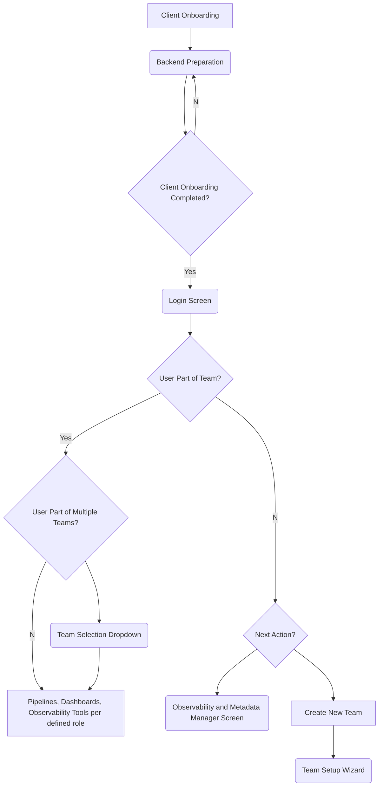

# User Interactions

Chimera provides a user-friendly interface that allows users to interact with the platform seamlessly. The UI is designed to be intuitive, responsive, and easy to navigate, enabling users to perform various tasks efficiently. Here are some key features of the Chimera UI:

1. **Dashboard**: The dashboard provides an overview of the user's workspace, including recent activities, data sources, and notifications.
2. **Data Catalog**: Users can browse and discover available datasets through a centralized data catalog.
3. **Data Processing**: Users can define data transformation rules, orchestrate data processing workflows, and monitor job status.
4. **Data Storage**: Users can manage data storage options, partition data, and set up backup and recovery mechanisms.
5. **Data Access and Analysis**: Users can explore and analyze data using built-in tools or integrate with external analytics platforms.
6. **User Management**: Admins can manage user roles, access controls, and permissions to ensure data security and compliance.
7. **Documentation**: Users have access to comprehensive documentation and tutorials to help them get started and troubleshoot issues.
8. **Support**: Users can reach out to the support team for assistance or join the community forum to connect with other users.

The Chimera UI aims to provide a seamless and enjoyable user experience, enabling users to focus on creating value from their data without getting bogged down by complex interfaces or workflows. With its user-centric design and robust features, Chimera empowers users to harness the full potential of their data and drive innovation within their organizations.

## Backend Preparation

- Before the client interacts with Chimera, the backend team completes the hierarchical organization and onboarding setup.

Backend readiness includes -

- **Hierarchical Organization**: The backend team sets up the client's organization structure. This includes setting up the client's account, defining line of business/strategic business units, and hierarchy of domains and subdomains including the organizational heads.
- **Ontology and Taxonomy**: The backend team defines the ontology and taxonomy for the client's business conceptual data model.
- **Connecting to Key Services**: The backend team connects to the client's key services, such as incident and configuration management platform like ServiceNow, communication channels like Email Servers, Slack and Teams, GenAI services like OpenAI, User Authentication Services like LDAP, etc. Let's discuss any other services that need to be connected to Chimera.
- **Default Setup**: The backend team sets up default configurations for the client's organization - Kubernetes, Ray, Observability, and Metadata Manager Cluster with default namespace.
- **Final Step**: Chimera UI DNS set up and SSL certificate installation.

## User Flow

1. **Login Screen Creation**
   - The journey starts with a login screen for Chimera, authenticated with User Authentication Service (see above).
   - Clients use this entry point to access Chimera UI securely.
2. **Landing Page**
   - Upon successful login, users are directed to a **landing page**. There are two potential scenarios for this page:
     - **Scenario A:** User is already part of a team/workspace/project.
       - **Sub-scenario A.A**: User is a part of a **single** team/workspace/project.
         - The landing page will see all the features available for the team - pipelines, dashboards, observability tools, and a search bar for quick navigation per his role as defined within the team.
       - **Sub-scenario A.B:** User is part of **multiple** teams/workspaces/projects.
         - User will see a dropdown to switch between teams/workspaces/projects. Once selected, follow the same steps as Sub-scenario A.A.
     - **Scenario C:** User is not part of any team/workspace/project.
       - User will be able to see Observability and Metadata Manager Screens in a readonly mode. He can go ahead to create a new team/workspace/project. Please see the next step.
3. **Team Onboarding Screen**
   - If the user wants to onboard their team, they will be directed to a new screen designed with a **step-based layout**.
   - The process includes:
     - **Step 1:** Defining services (e.g., Ray or others).
     - **Step 2:** Configuring role-based access controls (RBAC) to establish team permissions.
     - **Step 3:** Additional fields or requirements that need further clarification.

## Next Steps

- Clarify backend onboarding steps and processes.
- Define the "no data available" flow for the landing page.
- Expand details for team onboarding fields and steps.

## Flow Diagram

