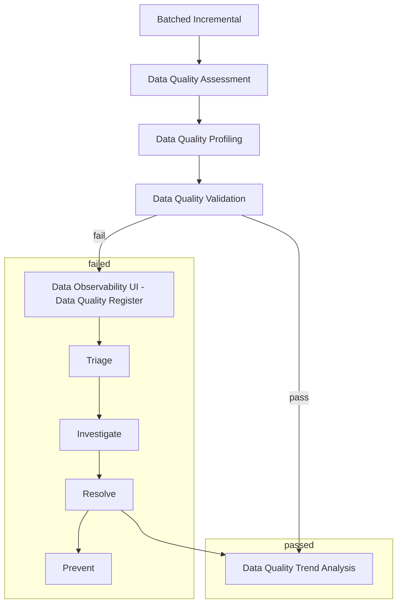

# Data Quality

Data quality is the process of ensuring that data is accurate, complete, and reliable. Data quality is important because it affects the accuracy of data analysis, decision-making, and business operations. Poor data quality can lead to incorrect conclusions, poor decisions, and wasted resources. Data quality is a critical component of data management and data governance.

## Data Quality Dimensions

Data quality can be measured using several dimensions, including:

### Accuracy

Please see [Data Accuracy](Data_Accuracy.md) for more information.

### Completeness

Please see [Data Completeness](Data_Completeness.md) for more information.

### Uniqueness

Please see [Data Uniqueness](Data_Uniqueness.md) for more information.

### Consistency

Please see [Data Consistency](Data_Consistency.md) for more information.

### Timeliness

Timeliness measures how up-to-date data is and how quickly it is available for analysis. Timely data is available when needed and is not outdated.

### Conformity

Conformity measures how well data conforms to the rules, standards, and constraints of its data model or schema. Conforming data is accurate, complete, and consistent with its data model.

### Integrity

Integrity measures how well data is protected from unauthorized access, modification, or corruption. Secure data is protected from security threats, breaches, and attacks.

### Validity

Validity measures how well data conforms to the rules, standards, and constraints of its data model or schema. Valid data is accurate, complete, and consistent with its data model.

### Relevance

Relevance measures how well data meets the needs of its users and stakeholders. Relevant data is useful, meaningful, and valuable for decision-making and analysis.

### Usability

Usability measures how easy it is to access, understand, and use data. Usable data is accessible, user-friendly, and well-documented.

### Trustworthiness

Trustworthiness measures how reliable, credible, and trustworthy data is. Trustworthy data is accurate, complete, consistent, and secure.

## Data Quality Metrics

## Measuring Consistency

Consistency can be measured by comparing data across different sources, systems, or time periods. Consistency can be measured using metrics such as discrepancy rate, conflict rate, and consistency score.

## Measuring Timeliness

Timeliness can be measured by assessing how quickly data is available for analysis or how up-to-date data is. Timeliness can be measured using metrics such as latency, freshness, and timeliness score.

## Measuring Conformity

Conformity can be measured by comparing data to the rules, standards, and constraints of its data model or schema. Conformity can be measured using metrics such as compliance rate, conformity rate, and conformity score.

## Measuring Integrity

Integrity can be measured by assessing how well data is protected from unauthorized access, modification, or corruption. Integrity can be measured using metrics such as security score, integrity score, and trust score.

## Measuring Validity

Validity can be measured by comparing data to the rules, standards, and constraints of its data model or schema. Validity can be measured using metrics such as validation rate, validity rate, and validity score.

## Measuring Relevance

Relevance can be measured by assessing how well data meets the needs of its users and stakeholders. Relevance can be measured using metrics such as relevance score, usefulness score, and value score.

## Measuring Usability

Usability can be measured by assessing how easy it is to access, understand, and use data. Usability can be measured using metrics such as accessibility score, user-friendliness score, and documentation score.

## Measuring Trustworthiness

Trustworthiness can be measured by assessing how reliable, credible, and trustworthy data is. Trustworthiness can be measured using metrics such as trust score, credibility score, and reliability score.

## Data Quality Tools

Data quality tools are software applications that help organizations monitor, measure, and improve the quality of their data. Data quality tools automate data profiling, data cleansing, data validation, data enrichment, and data monitoring tasks. Data quality tools help organizations identify data quality issues, resolve data quality problems, and prevent data quality errors.

Data quality tools include:

- Data profiling tools
- Data cleansing tools
- Data validation tools
- Data enrichment tools
- Data monitoring tools
- Data quality dashboards
- Data quality reports
- Data quality metrics
- Data quality rules
- Data quality checks
- Data quality alerts
- Data quality notifications
- Data quality workflows
- Data quality APIs
- Data quality integrations

## Data Quality Best Practices

Data quality best practices are guidelines, principles, and recommendations for improving the quality of data. Data quality best practices help organizations establish data quality standards, policies, and procedures. Data quality best practices help organizations ensure that data is accurate, complete, consistent, timely, relevant, valid, secure, usable, and trustworthy.

Data quality best practices include:

- Data quality assessment
- Data quality profiling
- Data quality cleansing
- Data quality validation
- Data quality enrichment

Data quality best practices help organizations identify data quality issues, resolve data quality problems, and prevent data quality errors. Data quality best practices help organizations improve data quality, data accuracy, data completeness, data consistency, data timeliness, data relevance, data validity, data integrity, data usability, and data trustworthiness.

## Data Quality Framework

A data quality framework is a structured approach to managing, measuring, and improving data quality. A data quality framework defines the processes, tools, techniques, and methodologies for assessing, monitoring, and enhancing data quality. A data quality framework helps organizations establish data quality standards, policies, and procedures. A data quality framework helps organizations ensure that data is accurate, complete, consistent, timely, relevant, valid, secure, usable, and trustworthy.

A data quality framework includes:

- Data quality dimensions
- Data quality metrics
- Data quality rules
- Data quality checks

A data quality framework helps organizations identify data quality issues, resolve data quality problems, and prevent data quality errors. A data quality framework helps organizations improve data quality, data accuracy, data completeness, data consistency, data timeliness, data relevance, data validity, data integrity, data usability, and data trustworthiness.

## Data Quality Challenges

Data quality challenges are obstacles, barriers, and issues that organizations face when managing, measuring, and improving data quality. Data quality challenges can arise from data errors, data inconsistencies, data inaccuracies, data incompleteness, data inconsistencies, data timeliness, data relevance, data validity, data integrity, data usability, and data trustworthiness.

Data quality challenges include:

- Data errors
- Data inconsistencies
- Data inaccuracies
- Data incompleteness

Data quality challenges can lead to incorrect conclusions, poor decisions, and wasted resources. Data quality challenges can affect the accuracy of data analysis, decision-making, and business operations. Data quality challenges can undermine the effectiveness of data management, data governance, and data quality initiatives.

## Data Quality Solutions

Data quality solutions are strategies, techniques, and tools for addressing data quality challenges and improving data quality. Data quality solutions help organizations identify data quality issues, resolve data quality problems, and prevent data quality errors. Data quality solutions help organizations improve data quality, data accuracy, data completeness, data consistency, data timeliness, data relevance, data validity, data integrity, data usability, and data trustworthiness.

Data quality solutions include:

- Data quality assessment
- Data quality profiling
- Data quality cleansing

Data quality solutions help organizations establish data quality standards, policies, and procedures. Data quality solutions help organizations ensure that data is accurate, complete, consistent, timely, relevant, valid, secure, usable, and trustworthy. Data quality solutions help organizations enhance data quality, data accuracy, data completeness, data consistency, data timeliness, data relevance, data validity, data integrity, data usability, and data trustworthiness.

## Data Quality Benefits

Data quality benefits are advantages, benefits, and outcomes that organizations gain from improving data quality. Data quality benefits include:

- Improved data accuracy
- Improved data completeness
- Improved data consistency
- Improved data timeliness
- Improved data relevance
- Improved data validity
- Improved data integrity
- Improved data usability
- Improved data trustworthiness
- Improved data analysis
- Improved decision-making
- Improved business operations

Data quality benefits help organizations make better decisions, improve business performance, and achieve their goals. Data quality benefits help organizations enhance data quality, data accuracy, data completeness, data consistency, data timeliness, data relevance, data validity, data integrity, data usability, and data trustworthiness.

## Data Quality Use Cases

Data quality use cases are examples, scenarios, and applications of data quality in practice. Data quality use cases demonstrate how organizations can use data quality tools, techniques, and best practices to improve data quality. Data quality use cases show how organizations can assess data quality, profile data quality, cleanse data quality, validate data quality, and enrich data quality.

Data quality use cases include:

- Data quality assessment use cases
- Data quality profiling use cases

Data quality use cases help organizations identify data quality issues, resolve data quality problems, and prevent data quality errors. Data quality use cases help organizations improve data quality, data accuracy, data completeness, data consistency, data timeliness, data relevance, data validity, data integrity, data usability, and data trustworthiness.

## Data Quality Resources

Data quality resources are references, guides, and tutorials for learning more about data quality. Data quality resources provide information, insights, and best practices for managing, measuring, and improving data quality. Data quality resources help organizations enhance data quality, data accuracy, data completeness, data consistency, data timeliness, data relevance, data validity, data integrity, data usability, and data trustworthiness.

Data quality resources include:

- Data quality books
- Data quality articles
- Data quality blogs

Data quality resources help organizations identify data quality issues, resolve data quality problems, and prevent data quality errors. Data quality resources help organizations improve data quality, data accuracy, data completeness, data consistency, data timeliness, data relevance, data validity, data integrity, data usability, and data trustworthiness.

## Data Quality Tools

Data quality tools are software applications that help organizations monitor, measure, and improve the quality of their data. Data quality tools automate data profiling, data cleansing, data validation, data enrichment, and data monitoring tasks. Data quality tools help organizations identify data quality issues, resolve data quality problems, and prevent data quality errors.

Data quality tools include:

- Data profiling tools
- Data cleansing tools
- Data validation tools

## Workflow

## Sources

- [Data Quality: The Importance of Data Quality](https://www.talend.com/resources/what-is-data-quality/)
- [Data Reliability Engineering](https://icedq.com/6-data-quality-dimensions)
- [Six Data Quality Dimensions](https://www.montecarlodata.com/blog-6-data-quality-dimensions-examples/)