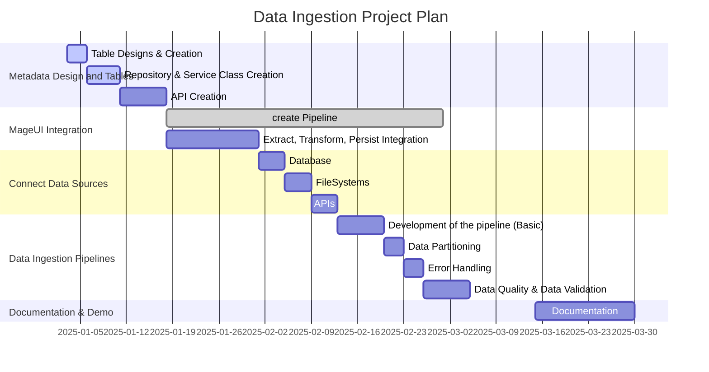

# Data Ingestion
<!-- TOC -->
- [Data Ingestion](#data-ingestion)
  - [Features](#features)
  - [Data Sources](#data-sources)
  - [Toolsets](#toolsets)
  - [Documentation](#documentation)
  - [Demos](#demos)
  - [Training](#training)
  - [Community and Ecosystem](#community-and-ecosystem)
  - [Roadmap](#roadmap)
- [Data Ingestion Project Plan](#data-ingestion-project-plan)
  - [What do we demonstrate?](#what-do-we-demonstrate)
    - [Ingestion Workflow](#ingestion-workflow)
      - [Intent to onboard](#intent-to-onboard)
      - [Discovery Phase (Optional) via Superset](#discovery-phase-optional-via-superset)
      - [Ingestion Phase](#ingestion-phase)
      - [In production phase](#in-production-phase)
<!-- TOC -->

- Overview of Data Ingestion
- Supported Data Sources
- Data Ingestion Methods
  - Batch Processing
  - Real-time Stream Processing
- Configuration and Setup
- Best Practices

## Features

1. **Connect Data Sources**: Users connect various data sources (e.g., databases, APIs, file systems) to Chimera.
2. **Data Ingestion Pipelines**: Users create and configure data ingestion pipelines to automate data collection and integration.
3. **Data Validation**: Chimera performs data validation to ensure data quality and consistency.
4. **Error Handling**: Users set up error handling mechanisms to address issues during data ingestion.
5. **Monitoring and Alerts**: Users monitor data ingestion pipelines and set up alerts to detect and resolve issues promptly.
6. **Data Lineage**: Chimera tracks data lineage to provide visibility into the origin and flow of data.
7. **Data Catalog**: A centralized data catalog provides metadata and documentation for ingested datasets.
8. **Data Partitioning**: Users can partition ingested data to optimize storage and query performance.
9. **Data Retention Policies**: Defining data retention policies to determine how long ingested data should be stored.
10. **Data Security**: Implementing security measures to protect ingested data from unauthorized access or breaches.
11. **Data Compression**: Chimera supports data compression techniques to reduce storage and processing costs.
12. **Data Deduplication**: Users can deduplicate ingested data to eliminate redundant records and optimize storage.
13. **Data Sampling**: Chimera provides tools for sampling ingested data to analyze subsets and validate results.
14. **Data Ingestion Performance**: Monitoring and optimizing data ingestion performance for efficiency and scalability.
15. **Data Ingestion APIs**: Users can leverage APIs to automate data ingestion processes and integrate with external systems.
16. **Data Ingestion Workflows**: Chimera supports workflows for creating, scheduling, and monitoring data ingestion tasks.
17. **Data Ingestion Plugins**: Users can develop custom plugins to extend Chimera's data ingestion capabilities.
18. **Data Ingestion Templates**: Pre-built templates for common data ingestion tasks to accelerate the process.
19. **Data Ingestion Scalability**: Ensuring that data ingestion pipelines scale with data volume and complexity.
20. **Data Ingestion Security**: Implementing access controls and encryption to secure data during ingestion.
21. **Data Ingestion Compliance**: Complying with data governance policies and regulations during data ingestion.
22. **Data Ingestion Monitoring**: Monitoring data ingestion pipelines for performance, errors, and compliance.
23. **Data Ingestion Optimization**: Optimizing data ingestion processes for speed, efficiency, and cost-effectiveness.
24. **Data Ingestion Automation**: Automating data ingestion tasks to reduce manual effort and errors.
25. **Data Ingestion Governance**: Enforcing governance policies to maintain data quality and integrity during ingestion.
26. **Data Ingestion Reporting**: Generating reports on data ingestion performance, errors, and compliance.
27. **Data Ingestion Collaboration**: Facilitating collaboration among users to share and improve data ingestion workflows.
28. **Data Ingestion Documentation**: Providing documentation and tutorials on data ingestion best practices and tools.
29. **Data Ingestion Support**: Offering support and assistance to users for troubleshooting data ingestion issues.
30. **Data Ingestion Community**: Building a community of users to share knowledge and best practices on data ingestion.
31. **Data Ingestion Training**: Providing training programs to help users learn data ingestion concepts and techniques.
32. **Data Ingestion Use Cases**: Illustrating common data ingestion use cases and scenarios for reference.
33. **Data Ingestion Challenges**: Addressing challenges and solutions related to data ingestion in real-world scenarios.
34. **Data Ingestion Trends**: Exploring emerging trends and technologies in data ingestion for future insights.
35. **Data Ingestion Case Studies**: Showcasing real-world examples and success stories of data ingestion implementations.
36. **Data Ingestion Resources**: Curating a collection of resources, tools, and articles on data ingestion for further learning.
37. **Data Ingestion Glossary**: Defining key terms and concepts related to data ingestion for clarity and understanding.
38. **Data Ingestion FAQ**: Answering frequently asked questions about data ingestion and related topics.
39. **Data Ingestion Blog**: Publishing blog posts and articles on data ingestion trends, best practices, and insights.
40. **Data Ingestion Webinars**: Hosting webinars and online events on data ingestion topics for knowledge sharing.
41. **Data Ingestion Podcasts**: Producing podcasts and interviews with experts on data ingestion and data management.
42. **Data Ingestion Demos**: Providing interactive demos and tutorials on data ingestion tools and techniques.
43. **Data Ingestion Workshops**: Conducting workshops and training sessions on data ingestion concepts and practices.
44. **Data Ingestion Events**: Organizing events and conferences on data ingestion for networking and learning opportunities.
45. **Data Ingestion Certifications**: Offering certifications and training programs on data ingestion skills and technologies.
46. **Data Ingestion Partnerships**: Collaborating with industry partners to enhance data ingestion capabilities and offerings.
47. **Data Ingestion Integrations**: Integrating with third-party tools and services to extend data ingestion functionalities.
48. **Data Ingestion Roadmap**: Outlining the future roadmap for data ingestion features and enhancements in Chimera.
49. **Data Ingestion Feedback**: Gathering feedback from users to improve data ingestion workflows and tools.
50. **Data Ingestion Updates**: Communicating updates and releases related to data ingestion features and improvements.
51. **Data Ingestion Contact**: Providing contact information for support, feedback, and inquiries related to data ingestion.
52. **Data Ingestion About**: Sharing information about the data ingestion team, vision, and mission in Chimera.

## Data Sources
- **Database**: Ingest data from various databases such as MySQL, PostgreSQL, Oracle, SQL Server, etc.
- **APIs**: Connect to RESTful APIs, GraphQL APIs, SOAP APIs, and other web services for data ingestion.
- **File Systems**: Ingest data from local files, cloud storage services, FTP servers, and other file systems.
- **Streaming Data**: Ingest real-time data streams from sources like Kafka, Kinesis, Pub/Sub, etc.
- **IoT Devices**: Connect to IoT devices and sensors to ingest data for monitoring and analysis.
- **Cloud Services**: Ingest data from cloud services like AWS, Azure, Google Cloud, etc.
- **Social Media**: Ingest data from social media platforms such as Twitter, Facebook, LinkedIn, etc.
- **Web Scraping**: Ingest data from websites and online sources using web scraping techniques.
- **Logs and Events**: Ingest logs, events, and telemetry data for monitoring and analysis.
- **Machine Learning Models**: Ingest data from machine learning models for predictions and insights.
- **External Systems**: Connect to external systems and applications for data ingestion.
- **Custom Sources**: Ingest data from custom sources using APIs, SDKs, or custom connectors.
- **Data Lakes**: Ingest data from data lakes like Hadoop, S3, Azure Data Lake, etc.
- **Data Warehouses**: Ingest data from data warehouses like Snowflake, Redshift, BigQuery, etc.
- **Business Applications**: Ingest data from business applications like CRM, ERP, HRM, etc.
- **SaaS Platforms**: Ingest data from SaaS platforms like Salesforce, HubSpot, Zendesk, etc.
- **Open Data Sources**: Ingest data from open data sources like government databases, public APIs, etc.
- **Legacy Systems**: Ingest data from legacy systems and databases for modernization and analysis.
- **Data Marketplaces**: Ingest data from data marketplaces and data providers for enrichment.
- **Data Feeds**: Ingest data feeds from financial markets, weather services, news sources, etc.
- **Data Catalogs**: Ingest metadata and data lineage information from data catalogs for analysis.
- **Data Pipelines**: Ingest data from data pipelines and ETL processes for further processing.
- **Data Repositories**: Ingest data from data repositories and data stores for analysis and insights.
- **Data Aggregators**: Ingest aggregated data from data aggregators and data brokers for analysis.

## Toolsets
- **Data Ingestion Tools**: Tools for connecting, collecting, and integrating data from various sources into Chimera.
- **Data Ingestion Pipelines**: Automated pipelines for ingesting, transforming, and loading data into Chimera.
- **Data Ingestion APIs**: APIs for programmatically ingesting data into Chimera from external systems and applications.
- **Data Ingestion Plugins**: Plugins for extending data ingestion capabilities and integrating with third-party services.
- **Data Ingestion Workflows**: Workflows for creating, scheduling, and monitoring data ingestion tasks in Chimera.
- **Data Ingestion Templates**: Pre-built templates for common data ingestion tasks to accelerate the process.
- **Data Ingestion Monitoring**: Tools for monitoring data ingestion pipelines for performance, errors, and compliance.
- **Data Ingestion Optimization**: Techniques for optimizing data ingestion processes for speed, efficiency, and cost-effectiveness.
- **Data Ingestion Automation**: Automation tools for reducing manual effort and errors in data ingestion workflows.
- **Data Ingestion Governance**: Policies and practices for enforcing governance during data ingestion to maintain data quality.
- **Data Ingestion Reporting**: Reports on data ingestion performance, errors, and compliance for monitoring and analysis.
- **Data Ingestion Collaboration**: Features for facilitating collaboration among users to share and improve data ingestion workflows.

## Documentation
- **Data Ingestion Documentation**: Documentation and tutorials on data ingestion best practices and tools for users.
- **Data Ingestion Use Cases**: Illustrations of common data ingestion use cases and scenarios for reference and learning.
- **Data Ingestion Challenges**: Addressing challenges and solutions related to data ingestion in real-world scenarios.
- **Data Ingestion Trends**: Exploring emerging trends and technologies in data ingestion for future insights and innovations.
- **Data Ingestion Case Studies**: Showcasing real-world examples and success stories of data ingestion implementations.
- **Data Ingestion Resources**: Curated collection of resources, tools, and articles on data ingestion for further learning.
- **Data Ingestion Glossary**: Definitions of key terms and concepts related to data ingestion for clarity and understanding.
- **Data Ingestion FAQ**: Answers to frequently asked questions about data ingestion and related topics.
- **Data Ingestion Blog**: Blog posts and articles on data ingestion trends, best practices, and insights for users.

## Demos
- **Data Ingestion Demos**: Interactive demos and tutorials on data ingestion tools and techniques for users.
- **Data Ingestion Events**: Events and conferences on data ingestion for networking and learning opportunities.
- **Data Ingestion Certifications**: Certifications and training programs on data ingestion skills and technologies for users.
- **Data Ingestion Partnerships**: Collaborations with industry partners to enhance data ingestion capabilities and offerings.
- **Data Ingestion Integrations**: Integrations with third-party tools and services to extend data ingestion functionalities.
- **Data Ingestion Feedback**: Gathering feedback from users to improve data ingestion workflows and tools.
- **Data Ingestion Updates**: Communicating updates and releases related to data ingestion features and improvements.

## Training
- **Data Ingestion Support**: Support and assistance for users to troubleshoot data ingestion issues and challenges.
- **Data Ingestion Community**: Community of users sharing knowledge and best practices on data ingestion in Chimera.
- **Data Ingestion Training**: Training programs to help users learn data ingestion concepts and techniques effectively.
- **Data Ingestion Webinars**: Webinars and online events on data ingestion topics for knowledge sharing and networking.
- **Data Ingestion Podcasts**: Podcasts and interviews with experts on data ingestion and data management for insights.
- **Data Ingestion Workshops**: Workshops and training sessions on data ingestion concepts and practices for learning.

## Community and Ecosystem
- **Data Ingestion Events**: Events and conferences on data ingestion for networking and learning opportunities.
- **Data Ingestion Certifications**: Certifications and training programs on data ingestion skills and technologies for users.
- **Data Ingestion Partnerships**: Collaborations with industry partners to enhance data ingestion capabilities and offerings.
- **Data Ingestion Integrations**: Integrations with third-party tools and services to extend data ingestion functionalities.

## Roadmap
- **Phase 1**: Implement basic data ingestion capabilities, including connecting data sources and setting up pipelines.
- **Phase 2**: Enhance data validation and error handling mechanisms to improve data quality and reliability.
- **Phase 3**: Introduce monitoring, alerts, and data lineage features for better visibility and control over data ingestion.
- **Phase 4**: Implement advanced data ingestion optimizations, such as compression, deduplication, and partitioning.
- **Phase 5**: Focus on scalability, security, and compliance aspects of data ingestion to support enterprise-level use cases.
- **Phase 6**: Develop data ingestion APIs, plugins, and integrations to extend functionality and interoperability with external systems.
- **Phase 7**: Provide training, documentation, and support resources to help users master data ingestion workflows and best practices.
- **Phase 8**: Establish a data ingestion community, organize events, and create content to foster knowledge sharing and collaboration.
- **Phase 9**: Continuously improve data ingestion based on user feedback, industry trends, and emerging technologies.
- **Phase 10**: Explore new data ingestion technologies, use cases, and partnerships to stay ahead of the curve in data management.
- **Phase 11**: Expand data ingestion offerings with certifications, workshops, and specialized training programs for users and partners.
- **Phase 12**: Collaborate with industry experts, conduct research, and publish insights on data ingestion trends and best practices.
- **Phase 13**: Innovate and experiment with data ingestion tools, techniques, and approaches to drive continuous improvement and growth.
- **Phase 14**: Celebrate data ingestion successes, share case studies, and recognize users for their contributions to the platform.
- **Phase 15**: Plan for the future of data ingestion, envisioning new features, capabilities, and opportunities for Chimera users.
- **Phase 16**: Engage with the data ingestion community, gather feedback, and co-create the next generation of data ingestion solutions.
- **Phase 17**: Reflect on the journey of data ingestion in Chimera, highlighting milestones, challenges, and achievements along the way.
- **Phase 18**: Reimagine data ingestion in the context of emerging technologies, trends, and user needs to shape the future of data management.
- **Phase 19**: Empower users to lead the way in data ingestion innovation, providing a platform for experimentation, learning, and growth.
- **Phase 20**: Elevate data ingestion to new heights, setting new standards for efficiency, reliability, and scalability in data management.
- **Phase 21**: Inspire the next generation of data professionals to explore the possibilities of data ingestion and its impact on the world.
- **Phase 22**: Transform data ingestion into a strategic asset for organizations, driving business value, insights, and competitive advantage.
- **Phase 23**: Envision a world where data ingestion is seamless, intuitive, and empowering for users of all backgrounds and skill levels.
- **Phase 24**: Lead the data ingestion revolution, shaping the future of data management and unlocking the full potential of data for all.
- **Phase 25**: Unleash the power of data ingestion, enabling users to harness the value of data and drive innovation in their organizations.
- **Phase 26**: Champion data ingestion excellence, setting the bar for best practices, standards, and performance in data management.
- **Phase 27**: Pioneer new data ingestion frontiers, exploring uncharted territories and pushing the boundaries of what is possible with data.
- **Phase 28**: Cultivate a culture of data ingestion innovation, collaboration, and learning, inspiring users to explore, experiment, and create.
- **Phase 29**: Embrace the future of data ingestion, embracing change, disruption, and transformation to stay ahead of the curve in data management.

# Data Ingestion Project Plan

Ingestion happens from external sources. You insource data from Postgres, MySQL, Files (csv, json, parquet), Snowflake, MongoDB, Kafka, and PDFs. It can be done as batch or stream. This becomes your set up to demonstrate the capability.

Feature to prove -
1. Simple onboarding of structure, semi-structured, and unstructure data assets
2. Well-governed onboarding
3. Performant ingestion
4. Fastest time to recover, Priority based recovery
5. Contained blast radius (avoiding noisy neighbour)

## What do we demonstrate?

Pre-requisite:
1. User is part of a team and is associated with a project / namespace.
2. Team's details (support email) is already present.
3. Project details are available.

### Ingestion Workflow

#### Intent to onboard

Assumption: User has appropriate rights to insource the external source. System should capture a declaration (contract) of his privilege to insource the external source. His team becomes the data producer of these data sources. This is the only way for us, because we do not know the owner of the external data. This may be contested by some organization, so we need to have the flexibility. However, this is not the scope of phase 1.

1. User opens his terminal, runs chimera cli and opts for ingestion.
2. Shell ask user to complete a json template with the connection string (URI) to the external source. The template should have information about the connectivity, and what he wants to insource. The name of the json should be unique. This json should be version controlled and would be used to track actions. 
3. Once the user is ready, they submit the json. The cli should validate the json, test the connectivity to the sources and responds success or failure.
4. User has already informed via the template if we should insource all tables/topics, specific tables/topics, or specific columns/events of tables/topic.
5. You onboard the external source (connection string) in Datahub using Datahub's API, and keep informing user. This is a synchronous call. Let the user know that we will let him know when all the metadata is insourced in our metadata store (Datahub).
6. You put an event in Kafka's "datasource onboarding" topic with user's intent detail (intent means what he wanted to insource. Look at point 4)
7. Datahub picks up the event and starts pulling all the metadata information (**define all the metadata information that you can capture per source type**) and once completed, sends a completion event on "datasource onboardinding completion" topic in Kafka.
8. Superset would be listening to "datasource onboarding completion" topic. Superset datasourcing is complete. Meaning Users can now connect to these sources. Once completed, Superset sends an event in "Data Discovery Available" topic.
9. User Notification service is listening to "Data Discovery Available" topic. It sends the information to user so they can get into Discovery Phase.

#### Discovery Phase (Optional) via Superset

1. User can now go to Superset, complete its discovery phase, and enter the final ingestion phase.

#### Ingestion Phase

1. User can pull any of their submitted json.
2. User can modify their intent to onboard list. He can reduce the list, but not increase in this phase. If he increases, "Intent to Onboard" Phase kicks off.
3. User can now add more details if he did not do it already. System should validate if the changes are being made to already onboaded pipeline or if it is really new.
   1. Trigger for insourcing (Timed, Event based, Adhoc)
   2. Frequency of insourcing (Timed)
   3. Way to insource - Full or detail or partitioned, etc.
   4. Where to save
   5. Format for save (Iceberg) - Phase 1
   6. Target can be of various types -
      1. Master Data Management - (effective from, effectivity to)
      2. Reference data - (effective from, effective to, valid from, valid to)
      3. Partitioned table.
   7. Deduplication if required.
   8. SLA of the dataset
   9. Data Classification - focus on PII and secret (like trade information)
   10. Schema mandatory for non-SQL data sources (file, MongoDB, Kafka).
4. If new,
   1. Pipeline name: <Name of the json file>_<DS Name>_<Table Name> - Please use this consistently with Datahub naming convention (urn).
   2. Metadata information captured - As defined by Datahub.
      1. Schema version including the point 3.6 fixed and synced with Datahub
      2. Ownership
      3. etc.
5. If changes are made to already onboarded pipeline, check what has changed.
   1. ssdflsdfjls
   2. asdasda

#### In production phase

1. As a part of user engagement, lets define pipeline priority within his group.
2. In case of failure a pipeline, how do we re-run.
3. In case of multiple failure, order in which the recovery happens. What should be the strategy? Overall minimun catch up time or priority list, with FAIR scheduling between all groups. - This should be part of orchestration service - Vivek.

Valid testing -
1. All the activities must be audited.
2. All quick DQ are done - schema validation, source-target row count validation.
3. Timeliness Checks - Timeliness Checks (Early warning list, Failed) - Side car implementation
4. All Detailed DQ checks are done (event based) - Data Profiling, Trend breaks or Anamoly detection based on historical data trends. - This is part of Data Management, not Ingestion Pipeline.
5. All pipeline information captured -
   1. When did it start?
   2. When did it end?
   3. What was the cpu/memory used?

Algorithm for fast recovery -

1. Total cpu of running + expected < Total CPU available for Production runs
2. Total memory of running + expected < Total memory available for Production runs
3. Maximize number of pipeline that can run per unit of time.
   1. "Unit of time" is the smallest run time of all the production pipeline.