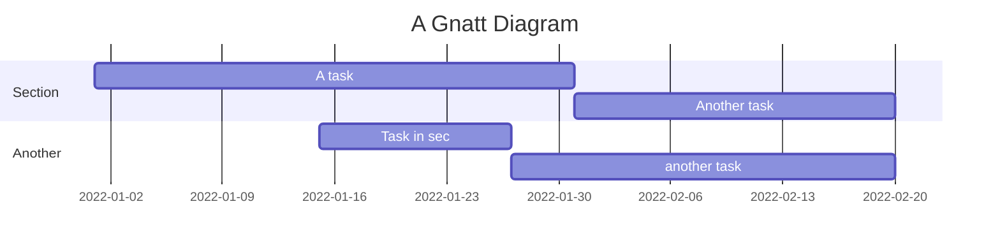

# Data Sharing and Distribution

<!-- TOC -->
* [Data Sharing and Distribution](#data-sharing-and-distribution)
  * [API-Based Sharing](#api-based-sharing)
    * [REST Based](#rest-based)
      * [Benefits of REST](#benefits-of-rest)
      * [Drawbacks of REST](#drawbacks-of-rest)
      * [Best practices](#best-practices)
    * [GraphQL Based](#graphql-based)
      * [Benefits of GraphQL-Based Sharing](#benefits-of-graphql-based-sharing)
      * [Drawbacks of GraphQL](#drawbacks-of-graphql)
      * [Best Practices for GraphQL-Based Sharing](#best-practices-for-graphql-based-sharing)
      * [Example Implementation](#example-implementation)
    * [Which One Should You Pick?](#which-one-should-you-pick)
  * [Table-Based Sharing](#table-based-sharing)
  * [Roadmap](#roadmap)
<!-- TOC -->

- Overview of Data Sharing
- Data Marketplaces
- Access Control and Permissions
- Distribution Channels
- Configuration and Setup
- Best Practices

## API-Based Sharing

APIs are the backbone of modern applications, acting as the bridge between client applications and backend servers.

Among the many API design choices, REST and GraphQL have emerged as two dominant approaches.

Both offer powerful ways to retrieve and manipulate data, but they are built on fundamentally different philosophies.

- **Authentication and Authorization**: Use OAuth2 or similar protocols to secure API access. Implement role-based access control (RBAC) to restrict data access based on user roles.
- **Rate Limiting and Throttling**: Implement rate limiting and throttling to prevent abuse and ensure fair usage of APIs.
- **Data Transformation**: Provide options for data transformation (e.g., filtering, aggregation) to deliver only the necessary data to consumers.
- **Monitoring and Logging**: Monitor API usage and maintain logs for auditing and troubleshooting purposes.
- **Versioning**: Implement versioning for APIs to ensure backward compatibility and allow consumers to migrate to newer versions at their own pace.
- **Error Handling**: Define clear error messages and status codes to help consumers troubleshoot issues effectively.

### REST Based

REST, a time-tested architectural style, structures APIs around fixed endpoints and HTTP methods, making it intuitive and widely adopted. REST emerged in the early 2000s as a set of architectural principles for designing networked applications. REST is not a protocol or standard but rather a set of guiding principles that leverage the existing HTTP protocol to enable communication between clients and servers. At its core, REST is built around resources. Each resource (such as a user, order, or product) is uniquely identified by a URL (Uniform Resource Locator), and clients interact with these resources using a fixed set of HTTP methods.
* GET → Retrieve a resource (e.g., GET /api/users/123 to fetch user data). 
* POST → Create a new resource (e.g., POST /api/users to add a new user). 
* PUT/PATCH → Update an existing resource (e.g., PUT /api/users/123 to update user details). 
* DELETE → Remove a resource (e.g., DELETE /api/users/123 to delete a user).

#### Benefits of REST
* Simplicity and Intuitive Design: The resource-based model aligns well with most business domains, making REST intuitive for developers. 
* Statelessness: Each request contains all the information needed to complete it, making REST scalable across distributed systems. 
* Cacheability: HTTP's caching mechanisms can be leveraged to improve performance. 
* Scalability: REST APIs can be easily scaled using load balancers and CDNs.
* Mature Ecosystem: With nearly two decades of widespread use, REST enjoys robust tooling, documentation, and developer familiarity.

#### Drawbacks of REST
* Over-fetching: REST endpoints often return more data than needed, leading to inefficient network usage. For example, if a mobile app only needs a user’s name and email, but the API response includes additional fields like address, phone number, and metadata, it results in wasted bandwidth.
* Under-fetching: If an API doesn’t return related data, the client may need to make multiple requests to retrieve all required information.
* Versioning issues: When APIs evolve, maintaining backward compatibility becomes difficult. REST APIs often require versioned URLs (/v1/users, /v2/users), adding maintenance overhead.
* Rigid Response Structure: The server defines how data is returned, and clients must adapt to it—even if they only need a subset of the data.

#### Best practices
- **RESTful APIs**: Implement RESTful APIs to provide standardized access to data. Ensure APIs are well-documented and follow industry standards such as OpenAPI.
- **Resource-Oriented Design**: Design APIs around resources and use HTTP methods (GET, POST, PUT, DELETE) to interact with them.
- **HATEOAS**: Implement HATEOAS (Hypermedia as the Engine of Application State) to provide links to related resources in API responses.
- **Caching Strategies**: Use caching mechanisms (e.g., ETags, cache-control headers) to improve API performance and reduce server load.
- **Pagination**: Implement pagination to handle large data sets and improve API performance.
- **Content Negotiation**: Support content negotiation to allow clients to request data in different formats (e.g., JSON, XML).
- **Stateless Communication**: Ensure APIs are stateless to improve scalability and reliability.
- **Security Considerations**: Implement secure communication (e.g., HTTPS), input validation, and protection against common security vulnerabilities (e.g., SQL injection, XSS).
- **Testing and Validation**: Test APIs thoroughly to ensure data integrity and validate responses against expected results.
- **Error Handling**: Define clear error messages and status codes to help consumers troubleshoot issues effectively.
- **Performance Optimization**: Optimize API performance by reducing response times, minimizing latency, and improving data retrieval efficiency.
- **Tooling and Ecosystem**: Leverage API management tools and frameworks (e.g., Swagger, Postman, Insomnia) to streamline API development, testing, and monitoring.
- **Documentation**: Provide comprehensive API documentation, including endpoints, request/response formats, authentication methods, and usage guidelines.
- **Community Support**: Engage with the developer community to gather feedback, address issues, and improve API usability.

### GraphQL Based

GraphQL offers several advantages over traditional RESTful APIs, such as more efficient data retrieval and greater flexibility in querying. With GraphQL, the client decides what to fetch. This makes GraphQL more flexible but also introduces challenges in caching and performance optimization. Both GraphQL and REST rely on HTTP requests and responses, but they differ in how they structure and deliver data.

|                   | REST                                                                       | GraphQL                                                                   |
|-------------------|----------------------------------------------------------------------------|---------------------------------------------------------------------------|
| Data Fetch        | Fixed endpoints                                                            | Flexible queries                                                          |
| Data focus        | REST centers around resources (each identified by a URL).                  | GraphQL centers around a schema that defines the types of data available. |
| Responsibility    | In REST, the API implementer decides which data is included in a response. | In GraphQL, the client specifies exactly what data it needs.              |
| Queries           | GET                                                                        | Queries (fetch data)                                                      |
| Updates           | POST, PUT, PATCH, DELETE                                                   | Mutations (modify data)                                                   |
| Real-time updates | WebSockets, polling                                                        | Subscriptions (real-time updates)                                         |


#### Benefits of GraphQL-Based Sharing

- **Efficient Data Retrieval**: Clients can request exactly the data they need, reducing over-fetching and under-fetching of data.
- **Single Endpoint**: All data queries and mutations are handled through a single endpoint, simplifying API management, solving REST's n+1 query problem.
- **Strongly Typed Schema**: GraphQL uses a strongly typed schema to define the structure of the API, making it easier to understand and use.
- **Real-Time Data with subscription**: GraphQL supports subscriptions, allowing clients to receive real-time updates.
- **Introspection**: Clients can query the schema to understand the available data and operations, improving discoverability. 
- **API Evolution Without Versioning**: New fields can be added without breaking existing queries, avoiding REST-style /v1, /v2 versioning issues.

#### Drawbacks of GraphQL
- **Complex Setup & Tooling**: Unlike REST, which can be used with basic HTTP clients (cURL, browsers), GraphQL requires a GraphQL server, schema, and resolvers. 
- **Caching challenges**: REST APIs leverage HTTP caching (e.g., browser caching, CDNs), but GraphQL queries use POST requests, making caching trickier. 
- **Increased Server Load**: Since clients can request arbitrary amounts of data, GraphQL APIs must be carefully optimized to prevent performance issues. 
- **Security Risks**: Unoptimized queries (e.g., deeply nested requests) can lead to costly database scans, increasing the risk of denial-of-service (DoS) attacks. 
- **Performance Risks with GraphQL**: Imagine a mobile app introduces a new feature that unexpectedly triggers a full table scan on a critical database table. With REST, this scenario is less likely because API endpoints are predefined, and developers control how data is exposed. With GraphQL, the client constructs the query, which could inadvertently request massive amounts of data. If a poorly designed query is executed on a high-traffic service, it could bring down the entire database. To mitigate this, GraphQL APIs require strict query rate limiting, depth restrictions, and cost analysis mechanisms—adding additional complexity to the implementation.

#### Best Practices for GraphQL-Based Sharing

- **GraphQL APIs**: Consider using GraphQL for flexible and efficient data querying. Provide a schema that allows consumers to request only the data they need.
- **Schema Design**: Design a well-structured GraphQL schema that reflects the underlying data model and provides a clear and intuitive API for clients. Use tools like Apollo Federation to compose multiple schemas into a unified graph.
- **Schema Stitching**: Use schema stitching to combine multiple GraphQL schemas into a single endpoint for easier consumption.
- **Schema Evolution**: Plan for schema evolution and versioning to accommodate changes in data requirements over time.
- **Subscription Support**: Implement subscriptions in GraphQL to enable real-time data updates and event-driven architectures. Use tools like Apollo Server to handle subscriptions efficiently.
- **Caching Strategies**: Implement caching strategies to reduce latency and improve performance for repeated queries. Use tools like Apollo Client to manage client-side caching and optimize data fetching.
- **Error Handling**: Define clear error handling mechanisms in GraphQL resolvers to provide meaningful error types, status codes and messages to consumers.
- **Security Considerations**: Ensure secure handling of sensitive data in GraphQL resolvers. Implement authentication and authorization mechanisms to protect data access. Implement security best practices such as input validation, query whitelisting, and rate limiting to protect against common security vulnerabilities.
- **Query Optimization**: Optimize queries to prevent over-fetching and under-fetching of data. Use tools like DataLoader to batch and cache requests for improved performance.
- **Performance Monitoring**: Monitor GraphQL query performance and optimize resolvers to reduce latency and improve user experience.
- **Performance Optimization**: Optimize GraphQL queries and resolvers for efficient data fetching and processing. Use tools like DataLoader to batch and cache requests for improved performance.
- **Monitoring and Logging**: Monitor GraphQL API performance and usage metrics to identify bottlenecks and optimize query execution. Maintain logs for auditing and troubleshooting purposes.
- **Testing and Validation**: Test GraphQL queries and mutations to ensure data integrity and validate schema changes before deployment. Use tools like Jest and Apollo Testing Library for testing GraphQL APIs.
- **Tooling and Ecosystem**: Leverage GraphQL tooling and ecosystem resources to streamline API development, testing, and monitoring. Use tools like Apollo Server, Prisma, and Nexus to build scalable and maintainable GraphQL APIs.
- **Documentation**: Provide comprehensive documentation for GraphQL APIs, including schema definitions, query examples, and usage guidelines. Use tools like GraphQL Playground and GraphiQL to explore and interact with the API.
- **Community Support**: Engage with the GraphQL community to stay updated on best practices, tools, and patterns for building scalable and maintainable APIs.

#### Example Implementation

Here is an example of how you can implement GraphQL-based data sharing:

* **Define the Schema**: Create a schema that defines the types, queries, and mutations.
```graphql
# schema.graphql
type User {
  id: ID!
  name: String!
  email: String!
}
type Query {
  getUser(id: ID!): User
  getAllUsers: [User]
}

type Mutation {
  createUser(name: String!, email: String!): User
}
```
* **Implement Resolvers**: Write resolvers to handle the queries and mutations.

```javascript
// resolvers.js
const users = [];

const resolvers = {
  Query: {
    getUser: (parent, args) => users.find(user => user.id === args.id),
    getAllUsers: () => users,
  },
  Mutation: {
    createUser: (parent, args) => {
      const newUser = { id: `${users.length + 1}`, name: args.name, email: args.email };
      users.push(newUser);
      return newUser;
    },
  },
};

module.exports = resolvers;
```

* **Set Up the Server**: Use a GraphQL server library (e.g., Apollo Server) to set up the server.

```javascript
// server.js
const { ApolloServer } = require('apollo-server');
const typeDefs = require('./schema.graphql');
const resolvers = require('./resolvers');

const server = new ApolloServer({ typeDefs, resolvers });

server.listen().then(({ url }) => {
  console.log(`🚀 Server ready at ${url}`);
});
```

By using GraphQL, you can provide a flexible and efficient way for clients to access and manipulate data, enhancing the overall data sharing experience.

### Which One Should You Pick?
There is no one-size-fits-all answer. REST remains a great choice for simple APIs, while GraphQL is powerful for complex applications with varying data needs.

**Use REST if:**
* Your API is simple and doesn’t require flexible queries.
* You need caching benefits from HTTP.
* You need a standardized, well-established API approach.
* You’re integrating with third-party services.
* Your team is already familiar with REST and need faster implementation.

**Use GraphQL if:**
* You need flexible and efficient data fetching.
* Your API serves multiple clients (mobile, web, IoT) with different data needs.
* Real-time updates are required (GraphQL subscriptions).
* You want to avoid API versioning issues. 
* Your application requires deeply nested data.
* If you know how to keep GraphQL secured and optimized.

> Please note: REST and GraphQL are not mutually exclusive, and many organizations implement a hybrid approach to get the best of both worlds:
> * GraphQL for client-facing applications where flexibility, performance, and dynamic querying are essential. 
> * REST for admin interfaces, third-party integrations, and internal microservices where statelessness, caching, and simplicity are beneficial.


## Table-Based Sharing

- **Data Views**: Create database views to provide controlled access to specific subsets of data. Ensure views are optimized for performance.
- **Access Controls**: Implement fine-grained access controls at the table and column levels to restrict access to sensitive data.
- **Data Masking**: Use data masking techniques to obfuscate sensitive information in shared tables.
- **Data Replication**: Set up data replication mechanisms to distribute data across different regions or systems while ensuring consistency.
- **Audit Trails**: Maintain audit trails to track data access and modifications for compliance and security purposes.
- **Data Retention Policies**: Define data retention policies to manage the lifecycle of shared data and ensure compliance with regulatory requirements.
- **Data Versioning**: Implement versioning for shared tables to track changes and enable consumers to access historical data.
- **Data Quality Monitoring**: Monitor data quality in shared tables to detect anomalies, errors, and inconsistencies.
- **Data Catalog Integration**: Integrate shared tables with the data catalog to provide visibility into available datasets and their metadata.
- **Performance Optimization**: Optimize table design, indexing, and query performance to ensure efficient data retrieval and processing.
- **Backup and Recovery**: Implement backup and recovery mechanisms to protect shared data from loss or corruption.
- **Data Encryption**: Use encryption techniques to secure data at rest and in transit when sharing tables across systems.
- **Data Governance Compliance**: Ensure shared tables comply with data governance policies, security standards, and regulatory requirements.
- **Data Transformation**: Provide data transformation capabilities to prepare shared data for consumption by different applications or users.
- **Data Lineage**: Maintain data lineage information to track the origin and transformation of shared data.
- **Data Collaboration**: Facilitate collaboration among data consumers by enabling them to share insights, annotations, and feedback on shared tables.
- **Data Access Requests**: Implement a process for users to request access to shared tables and ensure compliance with access control policies.
- **Data Usage Monitoring**: Monitor data usage patterns in shared tables to identify trends, anomalies, and potential security risks.
- **Data Sharing Agreements**: Establish data sharing agreements with consumers to define terms, responsibilities, and usage guidelines for shared tables.
- **Data Sharing Policies**: Define clear policies and procedures for sharing tables, including data access, usage restrictions, and compliance requirements.
- **Data Sharing Platforms**: Leverage data sharing platforms to facilitate secure and efficient sharing of tables across teams and systems.
- **Data Sharing Workflows**: Implement workflows for requesting, approving, and managing shared tables to streamline the data sharing process.
- **Data Sharing Notifications**: Notify users of new shared tables, updates, or changes to ensure they are aware of the latest data available for consumption.
- **Data Sharing Metrics**: Track data sharing metrics such as usage, access patterns, and feedback to evaluate the effectiveness of shared tables.
- **Data Sharing Governance**: Establish governance processes to oversee data sharing activities, enforce policies, and resolve disputes or issues related to shared tables.
- **Data Sharing Compliance**: Ensure data sharing practices comply with internal policies, industry regulations, and data privacy laws when sharing tables with external parties.
- **Data Sharing Security**: Implement security measures such as encryption, access controls, and monitoring to protect shared tables from unauthorized access or breaches.
- **Data Sharing Audits**: Conduct regular audits of shared tables to verify compliance with data sharing policies, security standards, and regulatory requirements.
- **Data Sharing Training**: Provide training and resources to users on data sharing best practices, security guidelines, and compliance requirements.
- **Data Sharing Collaboration**: Foster collaboration among data consumers by enabling them to share insights, analyses, and feedback on shared tables.
- **Data Sharing Feedback**: Collect feedback from users on shared tables to improve data quality, usability, and relevance for consumers.
- **Data Sharing Integration**: Integrate shared tables with analytics tools, reporting platforms, and other data systems to enable seamless data sharing and analysis.

By following these industry best practices, you can ensure secure, efficient, and compliant data sharing and distribution within your organization.

## Roadmap


