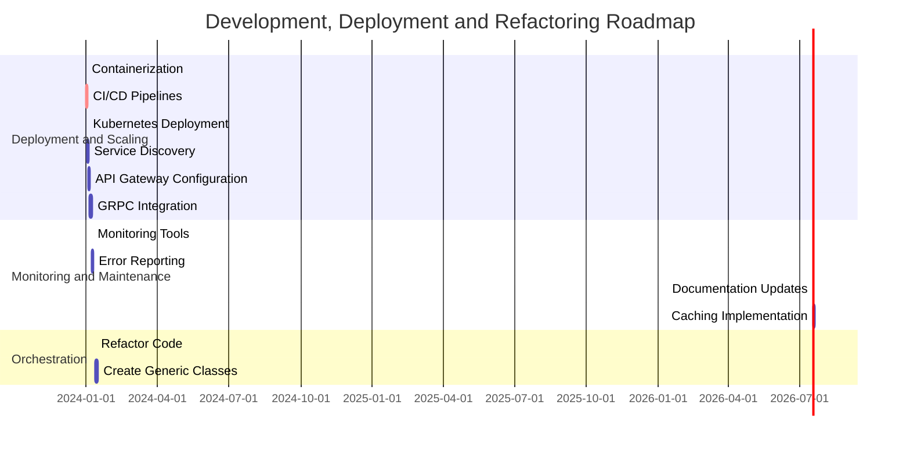

# API Services

API services are a critical component of a self-serve data platform, enabling users to access and interact with data programmatically. These services provide a standardized interface for querying, transforming, and analyzing data, making it easier for developers and data scientists to build applications and workflows that leverage the platform's capabilities.

In this guide, we'll explore the key considerations for designing and implementing API services in a self-serve data platform, including best practices, common use cases, and tools for building and managing APIs effectively.

## Key Considerations for API Services

When designing API services for a self-serve data platform, it's essential to consider the following key aspects:

### Standardized API Endpoints
  - Define clear and consistent API endpoints for accessing different data sources and services.
  - Use RESTful principles to structure API endpoints and resources logically.
  - Provide detailed documentation for each API endpoint, including input parameters, response formats, and error handling.
  - Implement versioning to ensure backward compatibility and manage changes effectively.
  - Use authentication and authorization mechanisms to secure API endpoints and control access to data.
  - Implement rate limiting and throttling to prevent abuse and ensure fair usage of API services.
  - Monitor API usage and performance metrics to identify bottlenecks and optimize resource allocation.
  - Implement caching mechanisms to improve API response times and reduce server load.
  - Use API gateways to manage API traffic, enforce security policies, and monitor API usage effectively.
  - Implement logging and auditing mechanisms to track API requests and responses for troubleshooting and compliance purposes.
  - Provide client libraries and SDKs to simplify API integration and development for users.
  - Implement testing and validation frameworks to ensure API reliability, performance, and security.
  - Use API management platforms to streamline API development, deployment, and monitoring processes.
  - Ensure scalability and fault tolerance by designing APIs to handle high traffic loads and recover from failures gracefully.
  - Implement API versioning and deprecation policies to manage changes and communicate updates effectively to users.
  - Use service meshes and microservices architectures to decouple API services and improve scalability, reliability, and maintainability.
  - Implement service discovery and load balancing mechanisms to distribute API traffic efficiently and ensure high availability and performance.
  - Use containerization and orchestration tools to deploy and manage API services in a scalable and resilient manner.
  - Implement continuous integration and deployment pipelines to automate API testing, deployment, and monitoring processes.
  - Use observability tools to monitor API performance, availability, and reliability in real-time and troubleshoot issues proactively.
  - Implement security best practices such as encryption, access controls, and monitoring to protect API services from security threats and breaches.
  - Ensure compliance with data privacy regulations by implementing measures to protect sensitive data and user information.
  - Implement data governance policies to ensure data quality, security, and compliance in API services and data access.
  - Provide comprehensive documentation and training resources to help users understand and leverage API services effectively.
  - Implement feedback mechanisms to gather user feedback and improve API services based on user needs and requirements.
  - Collaborate with users and stakeholders to gather requirements, prioritize features, and iterate on API design and implementation effectively.
  - Establish a feedback loop to collect user feedback, monitor API usage, and iterate on API design and implementation based on user needs and requirements.
  - Foster a culture of innovation, collaboration, and continuous improvement to drive API service excellence and user satisfaction.
  - Implement performance monitoring and optimization strategies to identify bottlenecks, optimize resource utilization, and improve API response times.
  - Use analytics and reporting tools to track API usage, performance metrics, and user feedback to measure the impact of API services and drive continuous improvement.
  - Implement incident response and disaster recovery plans to ensure business continuity and minimize downtime in case of API service disruptions or failures.
  - Provide user support and training resources to help users troubleshoot issues, optimize API usage, and leverage API services effectively.
  - Implement feedback mechanisms to gather user feedback, monitor API usage, and iterate on API design and implementation based on user needs and requirements.
  - Collaborate with users and stakeholders to gather requirements, prioritize features, and iterate on API design and implementation effectively.
  - Establish a feedback loop to collect user feedback, monitor API usage, and iterate on API design and implementation based on user needs and requirements.

### Scalable and Reliable Infrastructure
- Design API services to be scalable and fault-tolerant to handle high traffic loads and recover from failures gracefully.
- Use cloud-native technologies such as containers, serverless computing, and microservices to improve scalability, reliability, and maintainability.
- Implement service discovery and load balancing mechanisms to distribute API traffic efficiently and ensure high availability and performance.
- Use containerization and orchestration tools such as Docker and Kubernetes to deploy and manage API services in a scalable and resilient manner.
- Implement continuous integration and deployment pipelines to automate API testing, deployment, and monitoring processes.

### Open and Extensible Architecture

- [Data Contract Specification - OpenAPI](https://swagger.io/specification/)

### Implementing API Gateway

I would to use Kong API Gateway to manage API traffic, enforce security policies, and monitor API usage effectively.

```java

public class APIGateway {

    private static final String KONG_ADMIN_URL = "http://localhost:8001";
    private static final String KONG_API_URL = "http://localhost:8000";
    private static final String KONG_API_NAME = "my-api";
    private static final String KONG_API_UPSTREAM_URL = "http://localhost:8080";

    public static void main(String[] args) {
        createAPI();
        createRoute();
    }

    private static void createAPI() {
        try {
            URL url = new URL(KONG_ADMIN_URL + "/apis/");
            HttpURLConnection connection = (HttpURLConnection) url.openConnection();
            connection.setRequestMethod("POST");
            connection.setRequestProperty("Content-Type", "application/json");
            connection.setDoOutput(true);

            JSONObject api = new JSONObject();
            api.put("name", KONG_API_NAME);
            api.put("upstream_url", KONG_API_UPSTREAM_URL);

            OutputStreamWriter writer = new OutputStreamWriter(connection.getOutputStream());
            writer.write(api.toString());
            writer.flush();

            if (connection.getResponseCode() == HttpURLConnection.HTTP_CREATED) {
                System.out.println("API created successfully");
            } else {
                System.out.println("Failed to create API: " + connection.getResponseCode());
            }

            connection.disconnect();
        } catch (Exception e) {
            e.printStackTrace();
        }
    }

    private static void createRoute() {
        try {
            URL url = new URL(KONG_ADMIN_URL + "/apis/" + KONG_API_NAME + "/routes");
            HttpURLConnection connection = (HttpURLConnection) url.openConnection();
            connection.setRequestMethod("POST");
            connection.setRequestProperty("Content-Type", "application/json");
            connection.setDoOutput(true);

            JSONObject route = new JSONObject();
            route.put("paths", new String[]{"/my-api"});
            route.put("strip_path", true);

            OutputStreamWriter writer = new OutputStreamWriter(connection.getOutputStream());
            writer.write(route.toString());
            writer.flush();

            if (connection.getResponseCode() == HttpURLConnection.HTTP_CREATED) {
                System.out.println("Route created successfully");
            } else {
                System.out.println("Failed to create route: " + connection.getResponseCode());
            }

            connection.disconnect();
        } catch (Exception e) {
            e.printStackTrace();
        }
    }
}

```

## Roadmap

