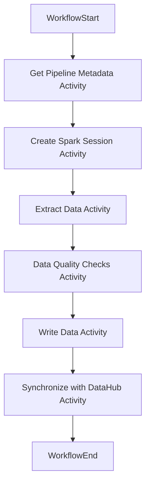

# Data Ingestion Workflow with Temporal

This document describes the steps involved in the Data Ingestion workflow, leveraging Temporal for orchestrating the process. It provides a high-level overview of each activity in the workflow.

## Workflow: Data Ingestion

### Activity Sequence

| Activity Seq | Activity                                    |
|--------------|--------------------------------------------|
| 1            | Get the Pipeline Metadata                 |
| 2            | Create a Spark Session                    |
| 3            | Connect to the Data Source and Extract Data |
| 4            | Perform Data Quality (DQ) Checks          |
| 5            | Write the Data                            |
| 6            | Synchronize with DataHub                  |

### Temporal Workflow Representation

Each activity in the Data Ingestion workflow is implemented as a Temporal activity and orchestrated by a Temporal workflow.

## Activity Details

1. **Get the Pipeline Metadata**
   - Temporal Activity: Fetch pipeline configuration details from PostgreSQL tables.
   - The metadata contains source and target information, as well as transformation and quality checks.

2. **Create a Spark Session**
   - Temporal Activity: Initialize a Spark session to enable distributed data processing.
   - Ensure the necessary configurations for data source connectivity and Spark execution.

3. **Connect to the Data Source and Extract the Data**
   - Temporal Activity: Use the metadata to establish a connection to the data source (e.g., RDBMS, files, streams).
   - Extract data using optimized queries or batch processing.

4. **Perform Data Quality (DQ) Checks**
   - Temporal Activity: Validate the extracted data against predefined rules and thresholds.
   - Examples include null checks, schema validation, and data completeness checks.

5. **Write the Data**
   - Temporal Activity: Load the transformed and validated data into the configured target database or table.
   - Follow the mappings and configurations provided in the pipeline metadata.

6. **Synchronize with DataHub**
   - Temporal Activity: Update DataHub with lineage and metadata about the ingested data.
   - Ensure consistency and traceability of data workflows.

## Prerequisites

- PostgreSQL database with the required metadata tables.
- Apache Spark setup configured for the environment.
- Temporal server and SDK for orchestrating the workflow.
- Temporal server should be up, task queues available, and workers available.
- DataHub instance for metadata synchronization.
- REST API for `databaseOps` is available for database operations.

## Execution

1. Ensure the metadata tables in PostgreSQL are up-to-date with pipeline configurations.
2. Deploy the Temporal workflow and activities.
3. Trigger the Temporal workflow with the necessary parameters.
4. Monitor the Temporal web UI or logs to ensure successful completion of all steps.
5. Verify the data quality results and synchronize the metadata.

## Additional Notes

- Temporal provides resiliency and fault tolerance for the workflow, ensuring seamless retries in case of failures.
- The workflow supports various data sources such as relational databases, files, streams, and NoSQL.
- Ensure appropriate error handling and logging for each Temporal activity to troubleshoot issues effectively.
- DataHub integration is optional but recommended for metadata management and lineage tracking.
