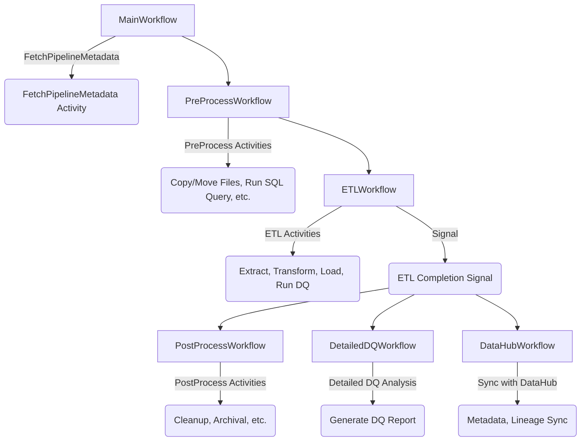

# Temporal Workflow Orchestration

This repository demonstrates a data processing pipeline orchestrated using **Temporal Workflows**. The workflow consists of multiple stages, ensuring efficient data processing, validation, and lineage tracking.

## Workflow Overview

The workflow follows this sequence:

1. **MainWorkflow** → Orchestrates the entire process.
2. **PreProcessWorkflow** → Executes preparatory activities before ETL.
3. **ETLWorkflow** → Extracts, transforms, and loads data.
4. **PostProcessWorkflow** → Executes post-processing activities.
5. **DetailedDQWorkflow** → Runs detailed data quality checks.
6. **DataHubWorkflow** → Syncs metadata and lineage with DataHub.

---

## Workflow Diagram

---

## Workflow Details

### 1. **MainWorkflow**
- The entry point of the pipeline.
- Triggers the `PreProcessWorkflow`.
- **Activities:**
    - **FetchPipelineMetadata Activity** → Fetches the metadata from the PostgreSQL table for the given pipeline.

### 2. **PreProcessWorkflow**
- Executes preparatory activities before ETL.
- The output of this step may be used in `ETLWorkflow`.
- **Activities:**
    - Copy/Move files from one location to another.
    - Run SQL queries to create tables, prepare data structures, etc.

### 3. **ETLWorkflow**
- Extracts data from source systems.
- Transforms and cleanses the data.
- Loads processed data into the target system.
- **Activities:**
    - Extract data based on fetched metadata.
    - Transform data using predefined rules.
    - Load data into the target.
    - Run **Data Quality (DQ) Checks**.
- Generates a **Signal** at the end to trigger post-ETL workflows.

### 4. **PostProcessWorkflow**
- Handles activities similar to `PreProcessWorkflow` but post-ETL.
- **Activities:**
    - Cleanup of temporary files.
    - Archival or logging of processed data.

### 5. **DetailedDQWorkflow**
- Runs an in-depth **Data Quality Analysis**.
- Generates detailed reports on data anomalies and inconsistencies.
- **Activities:**
    - Run additional DQ rules.
    - Generate and publish DQ reports.

### 6. **DataHubWorkflow**
- Syncs metadata and lineage with **DataHub**.
- **Activities:**
    - Extract Spark execution plans.
    - Publish metadata and lineage to DataHub.

---

## Prerequisites

- **Temporal Server** running locally or on a cloud provider.
- Java-based workflow worker implementation.
- PostgreSQL for metadata storage (if applicable).
- Spark for data processing.

---