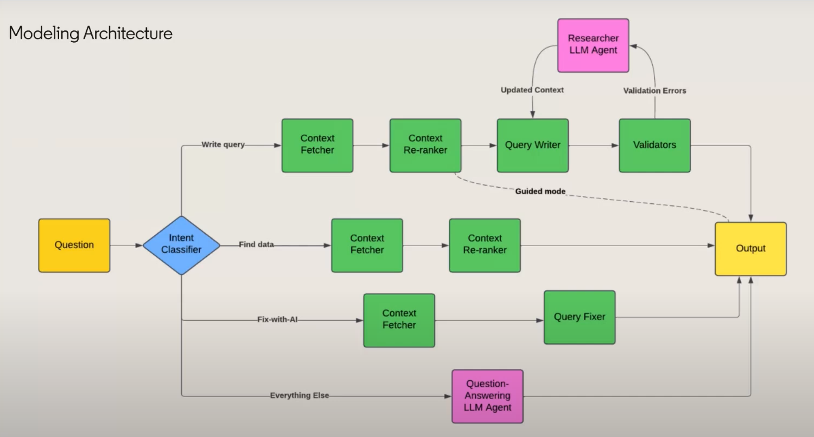
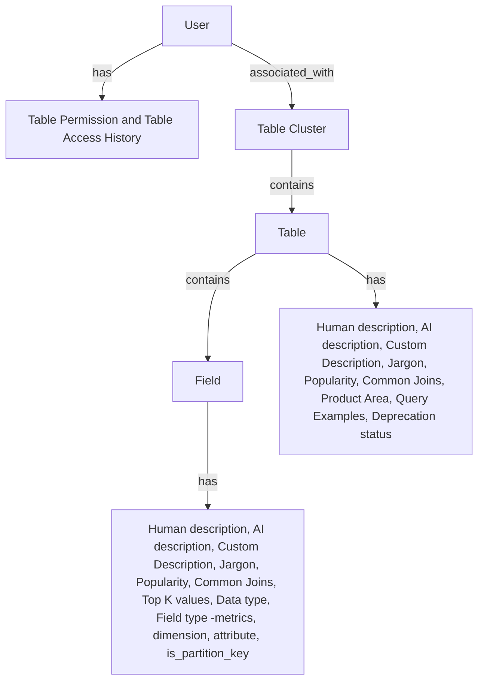
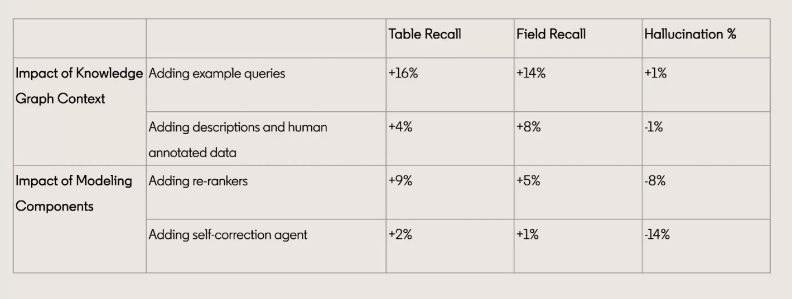

# Data Analytics Engine

The Data Analytics Engine is a component of the Data Platform that provides a set of tools and services to enable data analytics and data science workflows. The Data Analytics Engine is designed to be a scalable and flexible platform that can be used to process and analyze large volumes of data.

Trino is a distributed SQL query engine that is designed to be fast, scalable, and reliable. Trino is used to run SQL queries on large datasets and is optimized for performance and efficiency. Trino is a key component of the Data Analytics Engine and is used to run SQL queries on data stored in the Data Lake.

Trino can also be used to run queries on data stored in other data sources, such as relational databases, NoSQL databases, and cloud storage services. Trino supports a wide range of data formats and data sources, making it a versatile tool for data analytics and data science workflows.

## Text to SQL Assistant for Trino

The Text to SQL Assistant is a tool that helps users write SQL queries for Trino by providing suggestions and auto-completion for SQL keywords, table names, column names, and functions. The Text to SQL Assistant is designed to make it easier for users to write complex SQL queries and to reduce the likelihood of errors in their queries.

### Tips for building the Text to SQL Assistant

#### Quality Metadata

* Prioritize reliable sources with high information density
* Improved descriptions and examples queries -> big lift in accuracy
* Build an effective knowledge graph (This is something we should be doing in Metadata Catalog - Datahub)

We can source these information from:
* **DataHub**: Table permissions, Human description, Deprecation status, Data type, Field type (metrics, dimension, attribute), is_partition_key 
* **Domain Knowledge**: Custom Instructions, Jargon 
* **Query Logs**: Table Access History, Popularity, Common Joins, Query Examples, Product Area, Top K values

This model helps us to build a knowledge graph that can be used to generate suggestions and auto-completion for SQL queries in a more personalized way.

#### Query Validation

This is to fix the query before it is executed.
* Do all **tables** exists?
* Do all **columns** exists?
* Will the query **run** in a **reasonable time**?
* Does the user have **access** to the tables?

Knowledge graph can help here.

We can use a **self-correction agent** to fix errors. This agent can be trained using the query logs to understand the common mistakes and how to fix them.

#### Interactive Chat UX

* Write and execution queries in the same UI

* Timely assistant: "**Fix with AI**" button help to fix the query
* Human-in-the-loop: **Feedback** button to improve the assistant, Query explanation, etc. may help to improve the assistant.
* Rich-chat-elements: **Code snippets**, **Query examples**, **Query suggestions**, **Query explanations**, **Table Certification**, **Decicion tree** for response.

#### Self-serve Customization

Allow users to specify:
* **Custom Instructions**: User can specify custom instructions for the assistant to follow.
* **Custom Jargon**: User can specify custom jargon to be used by the assistant.
* **Custom Query Examples**: User can specify custom query examples to be used by the assistant.
* **Relevant Datasets**: User can specify the datasets and columns that are relevant to them.

#### Ongoing Benchmarking

* Curate your own benchmarking set
* Define metrics for each part of the stack: retrieval, query write, fixing, general QA, ranking, etc.
* Use LLM-as-a-judge framework to complement human evaluation 

> Note! The same question can be answered with different table/queries.

#### Privacy and Security

## Strategy to effective adoption

* Meeting users where they are: Enable capability in the main UI itself
* Understanding user's needs by analyzing the query logs, and user feedback
* Continuous improvement: Use user feedbacks and content addition to improve the assistant
* Making the bot interactions frictionless: Use rich-chat-elements, and human-in-the-loop to make the interaction more engaging

## Unleashing potential through LLM Agents

## References

* [LinkedIn Text-to-SQL](https://www.youtube.com/watch?v=rl4GLNEVkjo)
