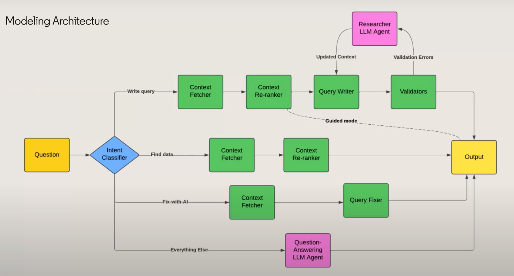
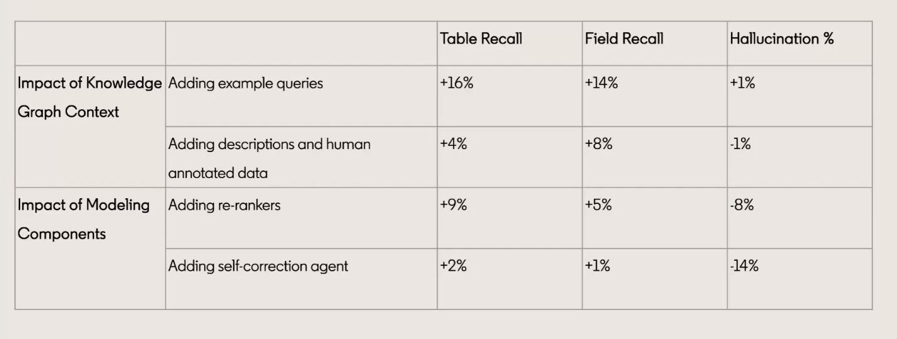

# Data Analytics Engine

The Data Analytics Engine is a component of the Data Platform that provides a set of tools and services to enable data analytics and data science workflows. The Data Analytics Engine is designed to be a scalable and flexible platform that can be used to process and analyze large volumes of data.

Trino is a distributed SQL query engine that is designed to be fast, scalable, and reliable. Trino is used to run SQL queries on large datasets and is optimized for performance and efficiency. Trino is a key component of the Data Analytics Engine and is used to run SQL queries on data stored in the Data Lake.

Trino can also be used to run queries on data stored in other data sources, such as relational databases, NoSQL databases, and cloud storage services. Trino supports a wide range of data formats and data sources, making it a versatile tool for data analytics and data science workflows.

## SQL Editor

Uses Superset as the SQL Editor. Superset is a modern, enterprise-ready business intelligence web application.

## Text to SQL Assistant for Trino

The Text to SQL Assistant is a tool that helps users write SQL queries for Trino by providing suggestions and auto-completion for SQL keywords, table names, column names, and functions. The Text to SQL Assistant is designed to make it easier for users to write complex SQL queries and to reduce the likelihood of errors in their queries.

### Tips for building the Text to SQL Assistant

#### Quality Metadata

* Prioritize reliable sources with high information density
* Improved descriptions and examples queries -> big lift in accuracy
* Build an effective knowledge graph (This is something we should be doing in Metadata Catalog - Datahub)

```mermaid
graph TD
    A[User] --has--> B[Table Permission and Table Access History]
    A --associated_with--> C[Table Cluster]
    C --contains--> D[Table]
    D --contains--> E[Field]
    D --has--> F[Human description, AI description, Custom Description, Jargon, Popularity, Common Joins, Product Area, Query Examples, Deprecation status]
    E --has--> G[Human description, AI description, Custom Description, Jargon, Popularity, Common Joins, Top K values, Data type, Field type -metrics, dimension, attribute, is_partition_key]
```

We can source these information from:
* **DataHub**: Table permissions, Human description, Deprecation status, Data type, Field type (metrics, dimension, attribute), is_partition_key 
* **Domain Knowledge**: Custom Instructions, Jargon 
* **Query Logs**: Table Access History, Popularity, Common Joins, Query Examples, Product Area, Top K values

This model helps us to build a knowledge graph that can be used to generate suggestions and auto-completion for SQL queries in a more personalized way.

#### Query Validation

This is to fix the query before it is executed.
* Do all **tables** exists?
* Do all **columns** exists?
* Will the query **run** in a **reasonable time**?
* Does the user have **access** to the tables?

Knowledge graph can help here.

We can use a **self-correction agent** to fix errors. This agent can be trained using the query logs to understand the common mistakes and how to fix them.

#### Interactive Chat UX

* Write and execution queries in the same UI

* Timely assistant: "**Fix with AI**" button help to fix the query
* Human-in-the-loop: **Feedback** button to improve the assistant, Query explanation, etc. may help to improve the assistant.
* Rich-chat-elements: **Code snippets**, **Query examples**, **Query suggestions**, **Query explanations**, **Table Certification**, **Decicion tree** for response.

#### Self-serve Customization

Allow users to specify:
* **Custom Instructions**: User can specify custom instructions for the assistant to follow.
* **Custom Jargon**: User can specify custom jargon to be used by the assistant.
* **Custom Query Examples**: User can specify custom query examples to be used by the assistant.
* **Relevant Datasets**: User can specify the datasets and columns that are relevant to them.

#### Ongoing Benchmarking

* Curate your own benchmarking set
* Define metrics for each part of the stack: retrieval, query write, fixing, general QA, ranking, etc.
* Use LLM-as-a-judge framework to complement human evaluation 

> Note! The same question can be answered with different table/queries.

#### Privacy and Security

## Strategy to effective adoption

* Meeting users where they are: Enable capability in the main UI itself
* Understanding user's needs by analyzing the query logs, and user feedback
* Continuous improvement: Use user feedbacks and content addition to improve the assistant
* Making the bot interactions frictionless: Use rich-chat-elements, and human-in-the-loop to make the interaction more engaging

## LLM Models

OpenAPI O

## Unleashing potential through LLM Agents

LLM Agents have an intrinsic to themselves with their access to different tools for updating their knowledge.

LLM Agents based on **Intent Classifier** -
* **Data Finder Agent**: Retrieve relevant tables, columns, and functions
* **Query Write Agent**: Generate SQL queries based on user input
* **Query Fixing Agent**: Fix errors in the query. 
  * Uses "Trino Explain" to detect errors and hallucinations
  * Fetched additional metadata from DataHub and updates context
  * Searches table/schema info and suggests corrections
* **General QA Agent**: Check the query for errors and suggest improvements
* **Ranking Agent**: Rank the suggestions based on relevance and accuracy
* **Benchmarking Agent**: Benchmark the assistant against a curated set of queries
* **Privacy and Security Agent**: Ensure that the assistant is secure and respects user privacy

```mermaid
graph LR
    A[User] --Question--> B[Intent Classifier]
    B --> C[Data Finder Agent]
    B --> D[Query Write Agent]
    B --> E[Query Fixing Agent]
    B --> F[General QA Agent]
    B --> G[Ranking Agent]
    B --> H[Benchmarking Agent]
    B --> I[Privacy and Security Agent]
    C --response--> A
    D --response--> A
    E --response--> A
    F --response--> A
    G --response--> A
    H --response--> A
    I --response--> A
    subgraph bot
        B
        subgraph LLM Agents
            C
            D
            E
            F
            G
            H
            I
        end
    end
```

### Deep dive into General QA Agent

* For "meeting users where they are", the General QA Agent can be used to provide feedback on the query and suggest improvements.
* Helps answer questions about the metadata stored across the vector stores and Knowledge Graph.
* This helps support questions ranging from optimizing code to updating existing code snippets to answering any general questions
* This also improves the interactivity with the user for follow-up questions and feedback.
* Uses LLM LangChain

```mermaid
graph TD
    A[Situation] --> B((General QA Agent))
    
    B --answer,context--> G((Self-correction Agent))
    G --give feedback--> B
    G --accept answer--> H((End))
    H --> I[Answer, Context]
    
    subgraph QA Agent
        B
        subgraph Tools
            C[Clean API results]
            D[Trino Validation Tool]
            E[Fetch Metadata Tool]
            F[Search Table/Schema Info Tool]
        end
        G
        H
    end
    B --call tool--> Tools
    Tools --tool response--> B
```

You are seeing four tools but there can be more tools that can be used by the General QA Agent to provide feedback on the query and suggest improvements.

## Question

How frequently should we refresh the metadata in Knowledge Graph?

Can users see the query that gets created?

## References

* [LinkedIn Text-to-SQL](https://www.youtube.com/watch?v=rl4GLNEVkjo)
