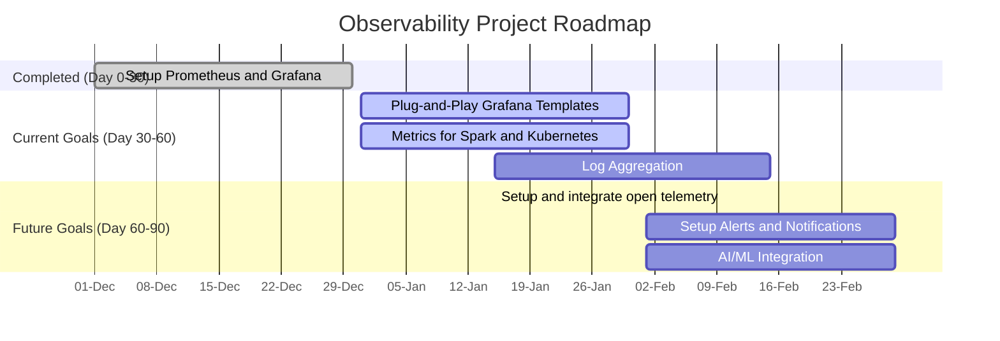

# Infrastructure and Application Observability

## Overview

This project provides a robust observability stack for monitoring and tracing applications and infrastructure. 
It leverages **Prometheus**, **Jaeger**, **Grafana**, and **OpenTelemetry** to deliver end-to-end visibility into the system. 
The data processing engines, **Apache Spark** and **Apache Flink**, are integrated for real-time and batch processing 
to support complex observability workflows.

## Key Features

- **Infrastructure Monitoring**: Collect and analyze metrics using Prometheus.
- **Application Tracing**: Distributed tracing with Jaeger and OpenTelemetry.
- **Visualization**: Interactive dashboards using Grafana.
- **Real-Time and Batch Processing**: Observability data processing pipelines using Apache Flink and Apache Spark.

## Stack Components

### 1. Prometheus
Prometheus is used to scrape metrics from various components of the system. 
These metrics are stored for real-time querying and long-term storage.

- **Use Case**: Metric collection and alerting.
- **Integration**: Metrics from services, nodes, and custom exporters.

### 2. Jaeger
Jaeger provides distributed tracing capabilities to understand and debug application performance across microservices.

- **Use Case**: End-to-end tracing of requests.
- **Integration**: OpenTelemetry for instrumentation.

### 3. Grafana
Grafana offers a powerful visualization layer to create dashboards and alerts based on data from Prometheus and other sources.

- **Use Case**: Dashboard visualization and alerting.
- **Integration**: Prometheus, Jaeger, and custom data sources.

### 4. OpenTelemetry
OpenTelemetry serves as a unified framework for instrumenting code and collecting traces and metrics.

- **Use Case**: Application instrumentation.
- **Integration**: Jaeger for traces, Prometheus for metrics.

### 5. Apache Spark
Apache Spark processes observability data for batch workloads such as periodic summarization or historical analysis.

- **Use Case**: Batch processing and ETL.
- **Integration**: Read/write data from observability storage.

### 6. Apache Flink
Apache Flink handles real-time observability data streams for low-latency processing and alerting.

- **Use Case**: Real-time stream processing.
- **Integration**: Process data streams from OpenTelemetry and Prometheus.

## Architecture Diagram
![Observability Architecture]

## Setup Instructions

### Prerequisites
- Docker and Docker Compose
- Java 17
- Apache Maven (for Spark/Flink applications)

### Steps to Deploy
1. **Clone the Repository**


# Observability Project Roadmap

This is the roadmap for the observability project visualized using a Mermaid Gantt chart.


# Explanation of the Plan

Setup Prometheus and Grafana: Basic configuration and operational setup.

Plug-and-Play Grafana Templates: Develop reusable data models in Grafana to make it easier to create visualizations.
Add Metrics for Spark and Kubernetes: Include metrics relevant to your application (e.g., Spark job performance) and infrastructure (e.g., Kubernetes node health).

Setup Alerts and Notifications: Configure alerts in Grafana based on dashboard thresholds for real-time issue detection.
Integrate AI/ML Models: Plan and implement AI/ML features for predictive analysis and anomaly detection.

#### Discussions

## Plans
- **Setup Prometheus and Grafana server**: The team will start by setting up Prometheus and Grafana for basic monitoring and visualization. This means we should have Prometheus and Grafana server running on Kubernetes cluster. Infrastructure team needs to ensure that the scripts are deployable.

```
Actionable Items:
- Infrastucture team should know how to pick up new images and commands to run (via ArgoCD).
- Once deployed, you should be able to see the blank Prometheus and Grafana dashboards with no logs, metrics, traces, dashboards, alerts, or rules.
```
- Setup node exporters, kube-state-metrics, and other exporters (see below) to collect metrics from the Kubernetes cluster.
  - cAdvisor: Collects resource usage and performance characteristics of running containers. 
  - Kubelet: Exposes metrics about the node and the containers running on it.
  - Prometheus Adapter: Exposes custom metrics for autoscaling (@Infra team - are we using Keda or other utilities here).
  - Nginx Ingress Controller: Exposes metrics about the Nginx Ingress Controller. 
  - Etcd: Collects metrics from the etcd key-value store used by Kubernetes. 
  - CoreDNS: Exposes metrics about DNS queries handled by CoreDNS. 
  - API Server: Exposes metrics about the Kubernetes API server.
  - Scheduler: Exposes metrics about the Kubernetes scheduler.
  - Controller Manager: Exposes metrics about the Kubernetes controller manager.

```text
Actionable Items:
- Infrastructure team should investigate and find what else is required to be set to support Kubernetes cluster monitoring, auto-scaling, trouble-shooting, etc.
- We should be able to see the metrics (which we set up) dashboard in Grafana.
- We should be able to set up alerts and notifications in Prometheus in case of error. Infrastructure team should know how to set up alerts within the Observability code.
```

- For each independent service like Postgres, API, MageAI, Datahub project, Ray, IAM, (Storage related services), (who observes observability) etc. Some of these can be optional
  - Health-checks: Implement health checks for each service.
  - CPU usage: Monitor CPU usage for each service.
  - IO usage: Monitor IO usage for each service.
  - Memory usage: Monitor memory usage for each service.
  - Network usage: Monitor network usage for each service.
  - Disk usage: Monitor disk usage for each service.
  - Latency: Monitor latency for each service.
  - Error rate: Monitor error rate for each service.
  - Throughput: Monitor throughput for each service.
  - Uptime: Monitor uptime for each service.
  - Logs: Collect logs for each service.
  - Traces: Collect traces for each service.
  - Alerts: Set up alerts for each service (predict_linear, predict_anomaly, etc.).
  - Dashboards: Create dashboards for each service.
  - Documentation: Document the monitoring setup for each service.
  - Automation: Automate the monitoring setup for each service.
  - Integration: Integrate the monitoring setup with Prometheus and Grafana.

- For execution frameworks, like Spark, Flink, etc.
  - Metrics: Monitor metrics for each execution framework.
  - Logs: Collect logs for each execution framework.
  - Traces: Collect traces for each execution framework.
  - Spillage, Shuffling, etc. which are specific to execution engines.
  - Alerts: Set up alerts for each execution framework, including breaches for performance, OOMs, etc.
  - Dashboards: Create dashboards for each execution framework.
  - Integration: Integrate the monitoring setup with Prometheus and Grafana.
- For data pipeline observability, we need -
  - Start and Completion time: Monitor the start and completion time for each pipeline.
  - What was used and produced in the pipeline: Monitor the input and output data for each pipeline. Volumetrics about these datasets.
- Observing the observer,
  - Optimize for storage using retention policies.
  - Presenting the information for business and leadership decisions.
  - Planning and executing for optimization (using Agentic AI)

### Chapters & Topics:
## Integration and Monitoring Discussion
They explored the monitoring aspects, particularly how to display metrics in Grafana, 
and discussed the challenges of embedding Grafana dashboards into a ReactJS application. 
Abhinav highlighted the importance of understanding the pipeline and block levels for effective monitoring.
* Spark Integration and Configuration
* Grafana Dashboard Integration with ReactJS

## Embedding Grafana Dashboards
Abhinav Kumar explained how to embed Grafana dashboards into web applications, 
highlighting the tool's capabilities.
Abhinav also mentioned the option to publish snapshots and the new public dashboard feature currently in preview.

## Data Platform Observability and Monitoring Strategies
Abhinav Kumar outlined the steps necessary for building a data platform, 
including the creation of a pipeline and the implementation of health checks and distributed tracing. 
He highlighted key metrics for server and Kubernetes monitoring, such as memory consumption and pod status. 
Additionally, he stressed the importance of using open-source solutions like Prometheus for data collection and monitoring.

## Monitoring and Observability in Data Platforms

Observability and Data Insights Discussion
Abhinav Kumar discussed the significance of data models in observability, 
stressing that without proper source embedding, insights cannot be effectively derived. He explained how CPU distribution 
impacts pods and the necessity of prioritizing certain pods for better performance.

## Problem Diagnosis and Predictive Observability

Observability and Time in Distributed Systems
Abhinav Kumar explained that while time is often used to track events in distributed systems,
it is not the most reliable metric due to its relative nature. 
He stressed the need for accurate logging in Prometheus to identify patterns that could indicate impending issues, 
such as increasing latency. The goal is to predict problems before they occur, allowing for proactive measures.

## Observability and Data Integration Strategies
Abhinav Kumar expressed concerns about the effectiveness of existing observability tools,
noting that they often leave users to make sense of the data without clear guidance. He stressed the necessity for a 
robust instrumentation process and the integration of multiple data sources to enhance troubleshooting capabilities. 
Mohit Ranjan added that predictive analysis based on collected data is essential for improving system reliability.

## Data Insights and System Development Strategies
Abhinav Kumar discussed the lengthy process of developing a system that requires gathering data and insights, 
suggesting that initial solutions might be provided for free to build customer confidence. He outlined the roles of team members, 
with Rahul focusing on knowledge gathering and Manish on governance. 
Mohit Ranjan agreed on the importance of a structured approach to ensure the system's effectiveness.

## Key Questions:

* Is there any specific data model that I should create for my enterprise?
* How can we effectively predict and troubleshoot problems in our observability framework?


Observability
 - Infrastructure Observability
   - Network Observability
   - Storage Observability
   - Compute Observability
     - Virtualization Observability
     - Container Observability
     - Orchestration Observability
     - Automation Observability
     - Configuration Observability
 - Application Observability
   - Code Observability
   - Data Observability
   - Business Observability
   - Security Observability
   - Compliance Observability
   - Cost Observability
   - Performance Observability
   - Reliability Observability
   - Scalability Observability
   - Availability Observability
   - Latency Observability
   - Throughput Observability
   - Efficiency Observability
   - Utilization Observability
   - Capacity Observability
   - Error Observability
   - Fault Observability
   - Failure Observability
   - Incident Observability
   - Problem Observability
   - Change Observability
   - Configuration Observability
   - Deployment Observability
   - Release Observability
     - Version Observability
     - Patch Observability
     - Upgrade Observability
   - Version Observability
     - Patch Observability
     - Upgrade Observability
 - Data Observability
 - Business Observability
 - Security Observability
 - Compliance Observability
 - Cost Observability
 - Performance Observability
 - Reliability Observability
 - Scalability Observability
 - Availability Observability
 - Latency Observability
 - Throughput Observability
 - Efficiency Observability
 - Utilization Observability
 - Capacity Observability
 - Error Observability
 - Fault Observability
 - Failure Observability
 - Incident Observability
 - Problem Observability
 - Change Observability
 - Configuration Observability
 - Deployment Observability
 - Release Observability
 - Version Observability
    - Patch Observability
    - Upgrade Observability

 - Setup

